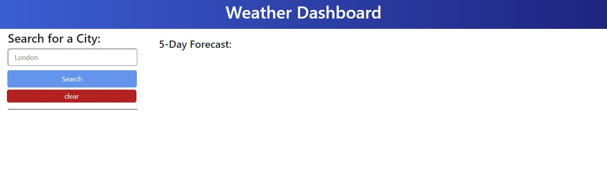
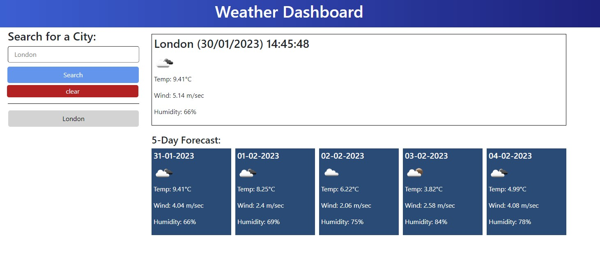
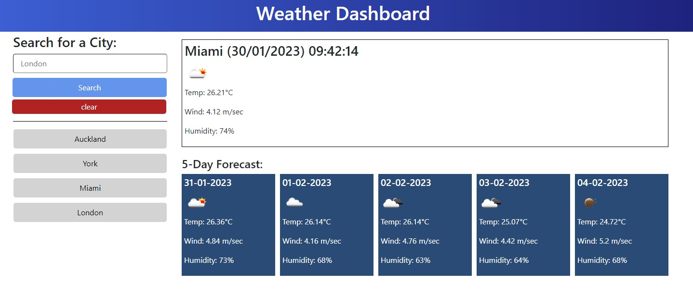

# WeatherDashboard
a simple weather application that allows a user to check the weather in a given city for that day, plus a five day forecast.

## Description 

This is an easy to use weather app that gives you information about the weather in a searched city, the current weather, and a five day forecast.
It gives you the temperature, wind speed and humidity for each day.

## Usage 

To use this website:
- Type in the text box, the city you would like to check the weather for.
- If you would like to search a city in a specific country, please add a comma after the city name, followed by the country.
- When you click the search button, the data will be presented on the right side of the screen.
- The current weather will be presented in the large top box, the five day forecast will be below that.
- Your searched cities will be stored in a list under the search and clear buttons to the left.
- If you click on the cities in the search history, you will be presented with the data for that city again.
- Upon reloading the page, the search history will still be there unless cleared.
- The clear button clears the search history.

(screenshot images below)

 
 
 

Link to active website: https://leanne-annable.github.io/WeatherDashboard/

## Credits

I used the information from our previous lessons in class for the basic structure,  
the information given on https://openweathermap.org/ in regards to how to use their API's, 
w3schools and stack overflow to help with styling issues. 

## License

This webpage is licenced under the MIT Licence

© 2023 edX Boot Camps LLC. Confidential and Proprietary. All Rights Reserved.